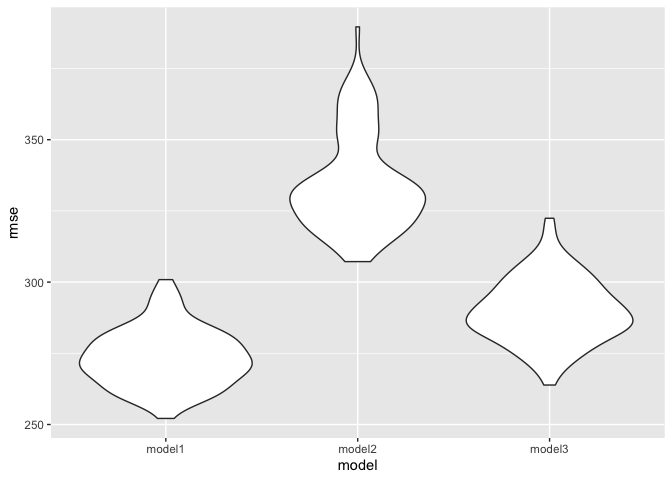
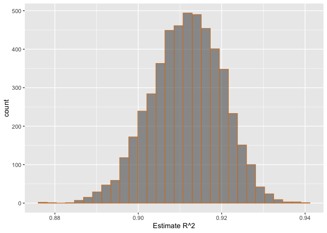
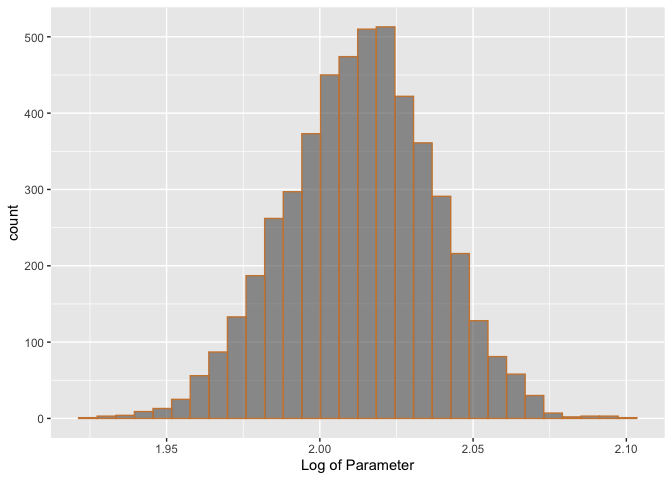

p8105\_hw6\_cc4347
================
CC
11/24/2019

# Problem 1: Child Birthweight Regression

## Load and Clean Dataset

``` r
#Load libraries
  library(tidyverse)
```

    ## ── Attaching packages ───────────────────────────────────────────────── tidyverse 1.2.1 ──

    ## ✔ ggplot2 3.2.1     ✔ purrr   0.3.2
    ## ✔ tibble  2.1.3     ✔ dplyr   0.8.3
    ## ✔ tidyr   1.0.0     ✔ stringr 1.4.0
    ## ✔ readr   1.3.1     ✔ forcats 0.4.0

    ## ── Conflicts ──────────────────────────────────────────────────── tidyverse_conflicts() ──
    ## ✖ dplyr::filter() masks stats::filter()
    ## ✖ dplyr::lag()    masks stats::lag()

``` r
  library(dplyr)
  library(modelr)

birth = read_csv("birthweight.csv") %>% 
  mutate(babysex = recode(babysex, 
                          "1" = "Male",
                          "2" = "Female"),
         fincome = fincome * 100,
         frace = recode(frace,
                        "1" = "White",
                        "2" = "Black",
                        "3" = "Asian",
                        "4" = "Puetro Rican",
                        "8" = "Other",
                        "9" = "Unknown"),
         mrace = recode(mrace,
                        "1" = "White",
                        "2" = "Black",
                        "3" = "Asian",
                        "4" = "Puetro Rican",
                        "8" = "Other"),
         malform = recode(malform, 
                          "0" = "Yes",
                          "1" = "No"
                          ),
         ) 
```

    ## Parsed with column specification:
    ## cols(
    ##   .default = col_double()
    ## )

    ## See spec(...) for full column specifications.

``` r
sum(is.na(birth))
```

    ## [1] 0

Recoded variables for sex, race of both parents, and presence of
malformations. There isn’t any missing
data.

## Regression Model for Birthweight

``` r
model_1 = lm(bwt ~ babysex + bhead + blength + bwt + delwt + gaweeks + momage + parity + ppbmi + smoken + fincome + mrace, data = birth)
```

    ## Warning in model.matrix.default(mt, mf, contrasts): the response appeared
    ## on the right-hand side and was dropped

    ## Warning in model.matrix.default(mt, mf, contrasts): problem with term 4 in
    ## model.matrix: no columns are assigned

``` r
summary(model_1)
```

    ## 
    ## Call:
    ## lm(formula = bwt ~ babysex + bhead + blength + bwt + delwt + 
    ##     gaweeks + momage + parity + ppbmi + smoken + fincome + mrace, 
    ##     data = birth)
    ## 
    ## Residuals:
    ##      Min       1Q   Median       3Q      Max 
    ## -1102.34  -184.66    -5.04   174.95  2345.81 
    ## 
    ## Coefficients:
    ##                     Estimate Std. Error t value Pr(>|t|)    
    ## (Intercept)       -5.732e+03  1.098e+02 -52.216  < 2e-16 ***
    ## babysexMale       -2.806e+01  8.458e+00  -3.317 0.000917 ***
    ## bhead              1.310e+02  3.447e+00  38.016  < 2e-16 ***
    ## blength            7.492e+01  2.020e+00  37.096  < 2e-16 ***
    ## delwt              3.601e+00  2.844e-01  12.661  < 2e-16 ***
    ## gaweeks            1.175e+01  1.461e+00   8.043 1.12e-15 ***
    ## momage             2.010e-01  1.189e+00   0.169 0.865766    
    ## parity             9.700e+01  4.045e+01   2.398 0.016535 *  
    ## ppbmi             -1.249e+01  1.925e+00  -6.491 9.47e-11 ***
    ## smoken            -4.852e+00  5.859e-01  -8.281  < 2e-16 ***
    ## fincome            2.886e-03  1.785e-03   1.617 0.106042    
    ## mraceBlack        -6.251e+01  4.309e+01  -1.451 0.146963    
    ## mracePuetro Rican -2.138e+01  4.586e+01  -0.466 0.641021    
    ## mraceWhite         7.531e+01  4.266e+01   1.766 0.077546 .  
    ## ---
    ## Signif. codes:  0 '***' 0.001 '**' 0.01 '*' 0.05 '.' 0.1 ' ' 1
    ## 
    ## Residual standard error: 272.5 on 4328 degrees of freedom
    ## Multiple R-squared:  0.7178, Adjusted R-squared:  0.717 
    ## F-statistic: 846.9 on 13 and 4328 DF,  p-value: < 2.2e-16

``` r
birth %>%
  modelr::add_residuals(model_1) %>%
  modelr::add_predictions(model_1) %>%
  ggplot(aes(x = pred, y = resid)) + geom_violin() + geom_hline(yintercept = 0, color = "peru")
```

    ## Warning in predict.lm(model, data): prediction from a rank-deficient fit
    ## may be misleading

    ## Warning in predict.lm(model, data): prediction from a rank-deficient fit
    ## may be misleading

<!-- -->

Describe modeling process: I decided to create a model that considered
many known possible underlying factors for low birthweight, which means
that it adjusts for all of the variables included. Consequently, the
result of this regression may be quite far from a crude estimate of
birth weight assessed from a single (or few) variable(s) of interest.
The plot of predicted values against residuals shows relatively constant
variance from 0. Roughly it appears that most data points fall between
-500-0 and 0-500 (on y-axis) with what appears to be a few outliers
skewing the distribution in both a positive and negative direction
(stronger skew in positive).

## Comparing Models

``` r
# Model predictors: length at birth and gestational age (main effects)
model_2 = lm(bwt ~ blength + gaweeks, data = birth)

# Model head circumference, length, sex, and interactions between all variables
model_3 = lm(bwt ~ (bhead + blength + babysex)^3, data = birth)

# Compare all 3 models
crossv_mc(birth, 100)  %>% 
  mutate(
    train = map(train, as_tibble),
    test = map(test, as_tibble)) %>% 
    mutate(model_1  = map(train, 
                     ~lm(bwt ~ babysex + bhead + blength + delwt + fincome + 
                           gaweeks + mheight + mrace + parity + ppwt + smoken, data = .x)),
         
         model_2  = map(train, ~lm(bwt ~ blength + gaweeks, data = .x)),
         
         model_3 = map(train, ~lm(bwt ~ (bhead + blength + babysex)^3, data = .x))
         )%>%
  mutate(rmse_model1 = map2_dbl(model_1, test, ~rmse(model = .x, data = .y)),
         rmse_model2 = map2_dbl(model_2, test, ~rmse(model = .x, data = .y)),
         rmse_model3 = map2_dbl(model_3, test, ~rmse(model = .x, data = .y))) %>%
    select(starts_with("rmse")) %>% 
  pivot_longer(
      everything(),
      names_to = "model", 
      values_to = "rmse",
      names_prefix = "rmse_") %>% 
    mutate(model = fct_inorder(model)) %>% 
    ggplot(aes(x = model, y = rmse)) +
  geom_violin()
```

<!-- -->

By plotting all three models against their respective RMSE (root mean
squared errors), we can see which is the best fit for the data. In this
case, Model 1 exhibits the lowest RMSE, which indicates that the
observed data points are closest to those predicted in this model. This
may be due to the fact that adding more variables to a model often gets
you closer to a better overall fit; however, overfitting like this isn’t
always an ideal practice. Model 3 shows the second best fit to the data
and considered only 3 variables and their interaction as opposed to the
12 varaibles used in Model 1.

# Problem 2: Weather Data Bootstrap

## Load Dataset

``` r
weather_df = 
  rnoaa::meteo_pull_monitors(
    c("USW00094728"),
    var = c("PRCP", "TMIN", "TMAX"), 
    date_min = "2017-01-01",
    date_max = "2017-12-31") %>%
  mutate(
    name = recode(id, USW00094728 = "CentralPark_NY"),
    tmin = tmin / 10,
    tmax = tmax / 10) %>%
  select(name, id, everything())
```

    ## Registered S3 method overwritten by 'crul':
    ##   method                 from
    ##   as.character.form_file httr

    ## Registered S3 method overwritten by 'hoardr':
    ##   method           from
    ##   print.cache_info httr

    ## file path:          /Users/alexandercoulter/Library/Caches/rnoaa/ghcnd/USW00094728.dly

    ## file last updated:  2019-11-24 11:07:10

    ## file min/max dates: 1869-01-01 / 2019-11-30

## Bootstrapping

``` r
boot_sample = function(df) {
  sample_frac(df, replace = TRUE)
}
boots = data_frame(
  strap_number = 1:5000,
  strap_sample = rerun(5000, boot_sample(weather_df))
)
```

    ## Warning: `data_frame()` is deprecated, use `tibble()`.
    ## This warning is displayed once per session.

``` r
boots_results = boots %>%
  mutate(models = map(strap_sample, ~lm(tmax ~ tmin, data = .x)),
         results_glance =  map(models, broom::glance),
         result_tidy = map(models, broom::tidy)
         ) %>%
  select(-strap_sample, -models) %>%
  unnest() %>%
  select(strap_number, r.squared, term, estimate) %>%
  pivot_wider(names_from = "term",
              values_from = "estimate") %>%
  janitor::clean_names() %>%
  mutate(logB = log(intercept * tmin))
```

    ## Warning: `cols` is now required.
    ## Please use `cols = c(results_glance, result_tidy)`

``` r
boots_results %>%
  summarise("R^2" = mean(r_squared),
            "Log(B0 * B1)" = mean(logB)) %>%
  knitr::kable(digits = 3)
```

|   R^2 | Log(B0 \* B1) |
| ----: | ------------: |
| 0.912 |         2.013 |

``` r
r_squared= boots_results %>%
  ggplot(aes(x = r_squared)) +
  geom_histogram(alpha = 0.6, color = "peru") +
  xlab("Estimate R^2") 
log= boots_results %>%
  ggplot(aes(x = logB)) +
  geom_histogram(alpha = 0.6, color = "peru") +
  xlab("Log of Parameter")
r_squared
```

    ## `stat_bin()` using `bins = 30`. Pick better value with `binwidth`.

<!-- -->

``` r
log
```

    ## `stat_bin()` using `bins = 30`. Pick better value with `binwidth`.

<!-- -->

Visually both histograms appear to be Normally distributed, although
there may be the slightly more left tail skew with the R^2 plot. That
plot is centered at 0.911 while the Log(B0\*B1) plot is centered at
2.013.

## Identify Quantiles (2.5% and 97.5%)

``` r
quantile(pull(boots_results, r_squared), probs = c(.025, .975)) %>% 
    knitr::kable(digits = 3)
```

|       |     x |
| ----- | ----: |
| 2.5%  | 0.894 |
| 97.5% | 0.927 |

``` r
quantile(pull(boots_results, logB), probs = c(.025, .975)) %>% 
    knitr::kable(digits = 3)
```

|       |     x |
| ----- | ----: |
| 2.5%  | 1.965 |
| 97.5% | 2.058 |

As can be expected because their disributions are unique, the calculated
quantiles differ, and the Log(B0\*B1) plot has higher quantiles since
its distribution is centered around a higher value. This gives us the
95% confidence intervals for the R^2 and logB parameters. So the 95%
confidence interval for R^2 is (0.894, 0.927), and the 95% confidence
interval for logB is (1.964, 2.058).
